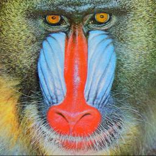
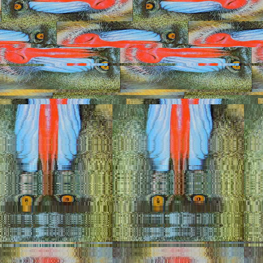

# Markov image generator

Main usage: building Markov models from images, and generating random images. 

Markov chain Python class:

- `MarkovImg(order)`: char level 

Methods:

- `learn(img, salt)`, creates a model given an image `img` and `salt` value.

- `generate(img_size)`, generates random image with a size `img_size`.

The `order>=1` parameter corresponds to the Markov chain order. 

The `0<=salt<=1` parameter helps with learning by randomly flipping the LSB in pixels. 

## Basic usage

```python
from markovimg import MarkovImg
from PIL import Image

img = Image.open("./test_images/lena.png")
img.show()
print(img.format, img.size, img.mode)
order,salt = 4,0.1
mc = MarkovImg(order)
mc.learn(img,salt)
im = mc.generate(img.size)
im.show()
```
Different values of the parameters will give different results. 

This example uses the standard `lena.png` with `order,salt = 4,0.1`:


to produce a random image like: 


One can also include successive image transformations as following:

```
from markovimg import MarkovImg
from PIL import Image

fname = "./test_images/mandrill.png"
img = Image.open(fname)
img.show()
order,salt = 3,0.4
mc = MarkovImg(order)
mc.learn(img,salt)
mc.learn(img.rotate(90),salt)
mc.learn(img.rotate(180),salt)
mc.learn(img.rotate(270),salt)
mc.learn(img.transpose(Image.FLIP_LEFT_RIGHT),salt)
mc.learn(img.transpose(Image.FLIP_TOP_BOTTOM),salt)
mc.learn(img.transpose(Image.ROTATE_90),salt)
mc.learn(img.transpose(Image.ROTATE_180),salt)
mc.learn(img.transpose(Image.ROTATE_270),salt)
im = mc.generate((img.size[0]*2,2*img.size[1]))
im.show()
```
This example uses the standard `mandrill.png` with `order,salt = 3,0.4`:



to produce a random image like: 




